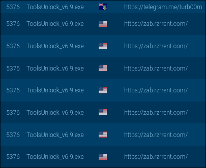
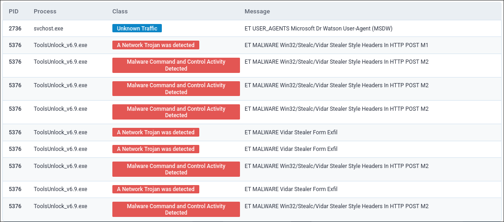
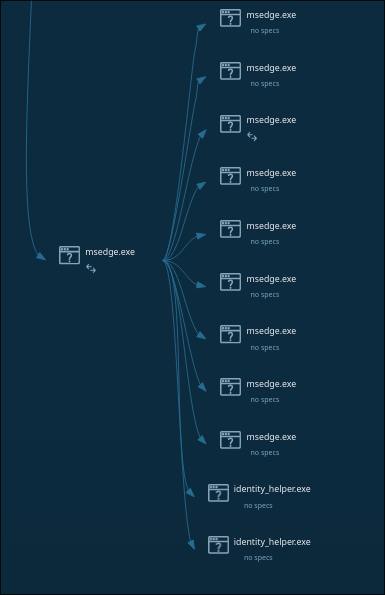

GitHub Apps are a feature which lets you integrate external services to into a repository or codebase. At least as early as October 2025 and as recently as July 2026 there is a distribution campaign through puppet GitHub Apps which promise cracked tools (or similar goodies) from an external download.

>This campaign was pointed out to me by my friend Elliott who has a talented history of examining malware and helped me with this research. You should read more about his endeavours at his blog, [Elliott.diy](https://elliott.diy).

A phony app can be found distributing this malware trivially through a Google dork. Given the existing popularity and SEO of GitHub, these puppet apps can easily take up the first few pages of a Google search with a simple dork like `site:github.com/apps "crack"`. With varying degrees of success other key phrases can be `free`, `game`, `cheat`, and `download`. What all of these have in common is an obviously LLM/AI generated page of slop prompting you to click the download link. When clicking through these various apps there are a small set of repeating styles of slop pages, likely from competing campaigns. 

The page I chose to examine was one offering some flavour of cracked Android recovery software. There are some obvious signs that this may not be a github app, like it not claiming to be one and the username is a nonsensical-jumble-of-characters name with this app being their only ever commit. 
When following the download button:
1. The user downloads a text file from Google Drive named `GetLink.txt`
2. This is a plaintext link and password to a DropBox file
3. Which contains a compressed archive of the malware named `ToolsUnlock.zip`, which can be decompressed with the password

>A neat side effect of the Google drive host is that (while logged in) you can go to `File -> Details` and get the email address of the host account, which ends up being the same account for many of the puppet apps on GitHub.
```
sinaolgvinshv72[@]gmai[.]com
```
```
# Preview link form of the google drive
[https://]drive[.]google[.]com/file/d/11jEPhB6_EfWa1Kn3khovnsGGMNmX7_yf/view?pli=1

# Content of the link
[https://]www[.]dropbox[.]com/scl/fi/hskmvo1wjh2sgkoagdcvq/ToolsUnlock.zip?rlkey=vz3y5ii3i8yh606rpsrbjc88d&st=v13baa5c&dl=1
Password: w8zt3a
```

I used any.run to perform an analysis of this malware. 

> My findings of this came from this any.run public analysis: https://app.any.run/tasks/fa00642a-77c7-4ae6-a8ee-3ccccbc09efe

This malware first calls to a public telegram chat, the description of which contains the URL of the C2 server that it then calls out to, alongside what appears to be a password.




Encrypted traffic continued to flow to this server for the duration that the machine was alive.



On top of the repeat malicious traffic, there were a large amount of re-launching the browser with various different flags. This image represents about 1/3 of the total launches.


