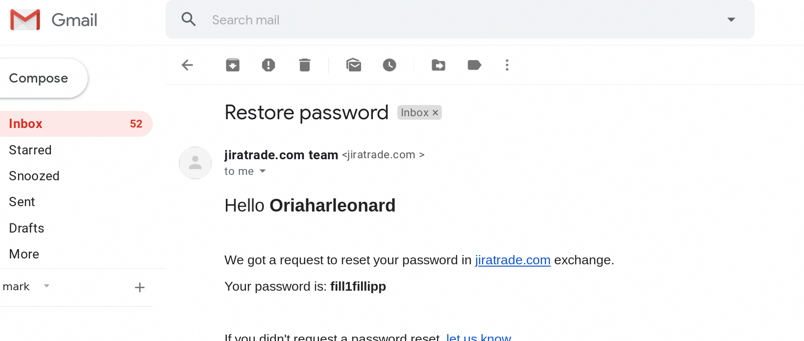
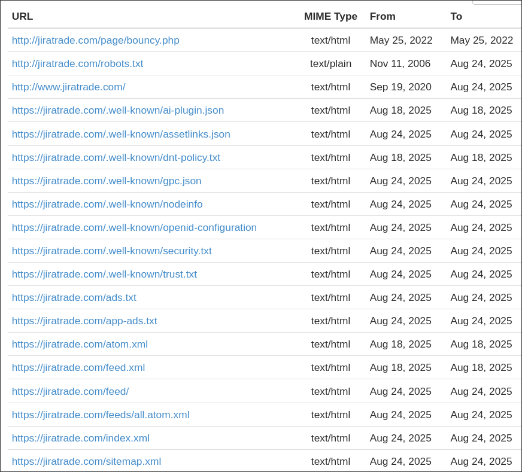

There exist many services that act as screenshot tools that will automatically host and generate a link to that screenshot so it can be easily shared. Many of these services, however, only use a few ASCII characters to identify each screenshot in a URL. This IDOR (Insecure Direct Object Reference) vulnerability creates what I like to call "Screenshot Bingo", where you can brute-force large amounts of these screenshots to look for PII. This was the first hack that I ever found and exploited myself, some time around 2021. Incredibly, through this, I uncovered a crypto-scam campaign! 

*As an alternative to running your own script to find and filter real screenshots, these days it can often be easier to take advantage of Google's default features, like the classic `site:"LeakMyScreenshotsOnTheInternet.com"` dork. Some websites even advertise the ability to see all the uploaded screenshots, for some reason.*

At the time I was able to find hundreds of screenshots of a fake conversation between two users, where one would tell the other about this 'amazing crypto service' they used through 'this plaintext link' and vouch that it gave them a bunch of free money. At some point you will usually find a series of wallet transfers where a small amount gets sent out and a larger amount gets sent back. I would hope that all readers know that this is not true.

Here is an example I was able to find today from one of these services, which will go unnamed.

This website is down and the domain is currently for sale, also note that this screenshot was not taken from a real Gmail portal. It is incredibly likely that you would log in to this account at `Oriaharleonard:fill1fillipp` and see a list of these transactions that prompts you to send money to the wallet of "thanks for sending me free bitcoin". 

There isn't hard evidence, but it's not hard to paint a picture if you read between the lines. [A user on reddit](https://www.reddit.com/user/Zengnom/) posts on r/Bitcoin warning about a potential scam, and out of the [three reviews on TrustPilot.com](https://www.trustpilot.com/review/jiratrade.com), two are poorly written English reviews (posted before LLMs were popular) by puppet accounts with 5 star reviews, with the third user claiming to have been scammed. If you look at the reviews of other accounts you will sadly find [this other review](https://www.trustpilot.com/review/lvltrade.com) on "Lvltrade" where it looks like one user lost 2500 USD of bitcoin in 2020, currently worth 17,000 USD, and someone else claims that it was a vector for fake extortion. It seems possible that these sites were pushed via other methods in addition to fake screenshots.

Doing a Google search for "jiratrade" shows a plethora of scam review websites, all giving quite a poor score. Historical domain information reveals that everything is obfuscated. Archive.org comes back with *almost* nothing, except for one URL. From 2006-2008 it was able to scrape the same robots.txt, but nothing else.

- https://web.archive.org/web/20070000000000*/http://jiratrade.com/robots.txt

To conclude, this is an interesting scam vector because it's such a painfully boring scam wrapped in such a pretty way. The only way that anyone would ever even visit the malicious site is if they are smart enough to know how to sift through obscured but public screenshots. At that point anyone who sees the scam thinks that they struck gold and that they're smarter than the fool who took a public screenshot of their crypto information, and that's exactly why it works. 
